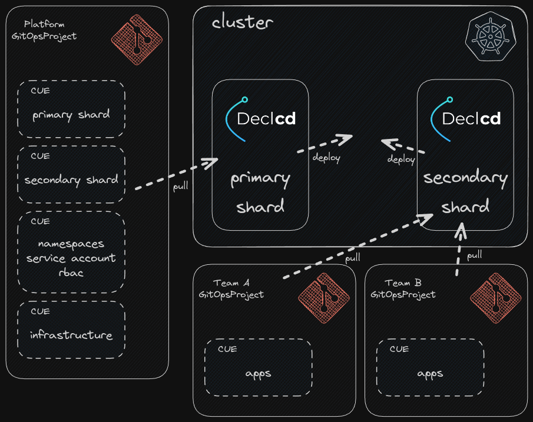

# Declcd Platform Example

This example uses Declcd to setup a Platform scenario with multiple teams/products within a K8s Cluster to illustrate how Declcd can provide
configuration constraints, sensible default values and quality of life features, like templates, without abstracting away operational capabilities for dev teams.

